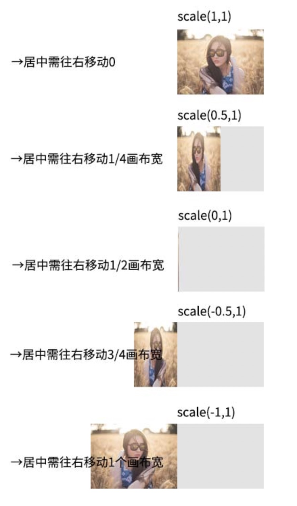

# canvas_study_demo
### starrySky
 1.先画一个**位置透明度随机**的**静态**的星星**实例对象**；  
 2.有一个可以**改变**星星**位置和透明度**的**draw方法**；  
 3.**定时器**跑起来，**画布**不停地**清除与绘制**，动画效果完成！
##### 难点在于 
- 1.星星的稀疏程度
    - 星星垂直方向实际上是个伪随机，越靠近地球，星星越密集，而越往上，越稀疏。其算法如下：  
    ````javascript
    const getMinRandom = function() {
        const rand = Math.random();
        // step的大小决定了星星靠近地球的聚拢程度，
        // step = Math.ceil(2 / (1 - rand))就聚拢很明显
        const step = Math.ceil(1 / (1 - rand));
        const arr = [];
        for (let i=0; i<step; i++) {
            arr.push(Math.random());
        }
    
        return Math.min.apply(null, arr);       
    };
    ````
- 2.圆弧轨迹  
    - 套用高中时候学的圆方程式  
      
    已知a,b, 求y相对于x的函数表达式…
    
### 雪花噪点(noise)  
  1.创建一个canvas，绘制一个300*150随机噪点图形  
  2.把这里具有噪点的canvas以画布形式在绘制到页面上的大canvas上  
  
上面的星空，总共最多就400个点（白色的星星），但是，这里的噪点，例如，demo中画布大小（那我的机子举例）是1920*500，其中，噪点大小是1像素*1像素，总共就有960000个绘制点，显然跟400个点完全不是一个数量级的，如果我们真的一个一个绘制下来，肯定，就连Chrome这么牛步的浏览器也会感觉到明显的卡顿，如何优化如何绘制呢？

这就是本例子实现的**难点**  
#### 数量与性能  
虽然最终的噪点大小是1920*500，但是，我们实际上是由N块300*150的小的像瓷砖一样的小方块拼起来的。话句话说，我实际只绘制了45000个点，比960000显然要小了20倍还不止。
这样，既满足了效果，又保证了性能。  
说得canvas绘图，不得不提一下非常常用的一个drawImage()方法  
`context.drawImage(img,sx,sy,swidth,sheight,x,y,width,height);`  
img	用来被绘制的图像、画布或视频。  
sx	可选。img被绘制区域的起始左上x坐标  
sy	可选。img被绘制区域的起始左上y坐标。  
swidth	可选。img被绘制区域的宽度。  
sheight	可选。img被绘制区域的高度。  
x	画布上放置img的起始x坐标。  
y	画布上放置img的起始y坐标。  
width	可选。画布上放置img提供的宽度。（伸展或缩小图像）  
height	可选。画布上放置img提供的高度。（伸展或缩小图像）  
本例的小的噪点区块就是通过drawImage()方法被**平铺**到大的canvas元素上的。
### 图片居中镜像翻转  
CSS中要想实现元素的翻转效果，比较简单，例如我们希望某一张图片水平镜像翻转，只需要一行CSS就可以了：  
`img {
     transform: scaleX(-1);
 }
`  
或  
`img {
     transform: scale(-1, 1);
 }`   
 
  
 但是在canvas中，则要麻烦一些，麻烦的并不是无法翻转，而是坐标系的定位。
 
 在Canvas中，如下代码可以实现资源的水平镜像翻转（假设context是Canvas的2d上下文）：  
 `context.scale(-1, 1);`  
 或者使用`setTransform` API直接矩阵变换  
 `context.setTransform(-1, 0, 0, 1, 0, 0);`  
 然而，翻转虽然实现了，但是Canvas中元素定位就出了很大的问题。这是因为Canvas的坐标变换系和CSS不一样，因此，如果我们想实现**居中翻转效果**，需要在翻转之前将目标元素的**中心点**移动到**变换轴**上。  
 在scale之前先**translate位移**变换后的水平偏移，然后就能看到一直居中翻转的效果了 
  
  如果水平scale为1, 0.5, 0, -0.5, -1时候的最终位置如下图示意：
   
 于是可以得到应当偏移的水平距离公式：
 
 `distance = (canvas.width – image.width * scale) / 2;`
   
 于是，最终镜像绘制图片的关键代码变成这样（假设水平缩放大小是scale）：  
 ````
// 坐标参考调整
context.translate((canvas.width - image.width * scale) / 2, 0);
context.scale(scale, 1);
context.drawImage(image, 0, 0);
// 坐标参考还原
context.setTransform(1, 0, 0, 1, 0, 0);
 ````  
#### 如何增加动画效果呢？
借助Tween.js   
Math.animation()方法   
`Math.animation(form, to, duration, easing, callback);`  
动画JS如下：
````
var canvas = document.querySelector('canvas');
var context = canvas.getContext('2d');
// 动画进行
Math.animation(1, -1, 600, 'Quad.easeInOut', function (value, isEnding) {
    // 清除画布内容
    context.clearRect(0, 0, canvas.width, canvas.height);
    // 调整坐标
    context.translate((canvas.width - canvas.width * value) / 2, 0);
    // 调整缩放
    context.scale(value, 1);
    // 绘制此时图片
    context.drawImage(eleImg, 0, 0);
    // 坐标参考还原
    context.setTransform(1, 0, 0, 1, 0, 0);
});
````
